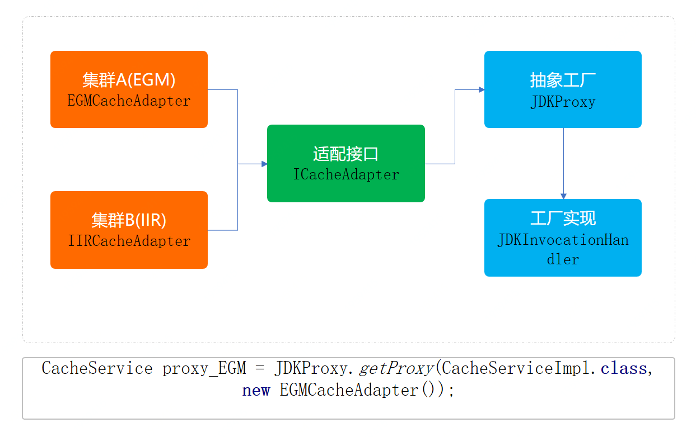

# 抽象工厂模式重构代码
接下来使用抽象工厂模式来进行代码优化，也算是一次很小的重构。

这里的抽象工厂的创建和获取方式，会采用代理类的方式进行实现。所被代理的类就是目前的Redis操作方法类，
让这个类在不需要任何修改下，就可以实现调用集群A和集群B的数据服务。

并且这里还有一点非常重要，由于集群A和集群B在部分方法提供上是不同的，因此需要做一个接口适配，
而这个适配类就相当于工厂中的工厂，用于创建把不同的服务抽象为统一的接口做相同的业务。

# 总结
* 抽象工厂模式，所要解决的问题就是在一个产品族，存在多个不同类型的产品(Redis集群、操作系统)情况下，
  接口选择的问题。而这种场景在业务开发中也是非常多见的，只不过可能有时候没有将它们抽象化出来。
  
* 你的代码只是被ifelse埋上了！当你知道什么场景下何时可以被抽象工程优化代码，
  那么你的代码层级结构以及满足业务需求上，都可以得到很好的完成功能实现并提升扩展性和优雅度。
  
* 那么这个设计模式满足了；单一职责、开闭原则、解耦等优点，但如果说随着业务的不断拓展，
  可能会造成类实现上的复杂度。但也可以说算不上缺点，
  因为可以随着其他设计方式的引入和代理类以及自动生成加载的方式降低此项缺点。