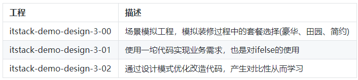
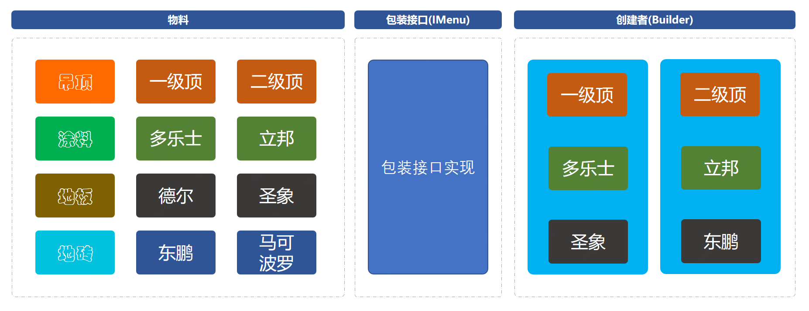

# 建造者模式重构代码

# 总结
* 通过上面对建造者模式的使用，已经可以摸索出一点心得。那就是什么时候会选择这样的设计模式，
  当：一些基本物料不会变，而其组合经常变化的时候，就可以选择这样的设计模式来构建代码。
  
* 此设计模式满足了单一职责原则以及可复用的技术、建造者独立、易扩展、便于控制细节风险。
  但同时当出现特别多的物料以及很多的组合后，类的不断扩展也会造成难以维护的问题。
  但这种设计结构模型可以把重复的内容抽象到数据库中，按照需要配置。这样就可以减少代码中大量的重复。
  
* 设计模式能带给你的是一些思想，但在平时的开发中怎么样清晰的提炼出符合此思路的建造模块，
  是比较难的。需要经过一些锻炼和不断承接更多的项目，从而获得这部分经验。有的时候你的代码写的好，
  往往是倒逼的，复杂的业务频繁的变化，不断的挑战！
