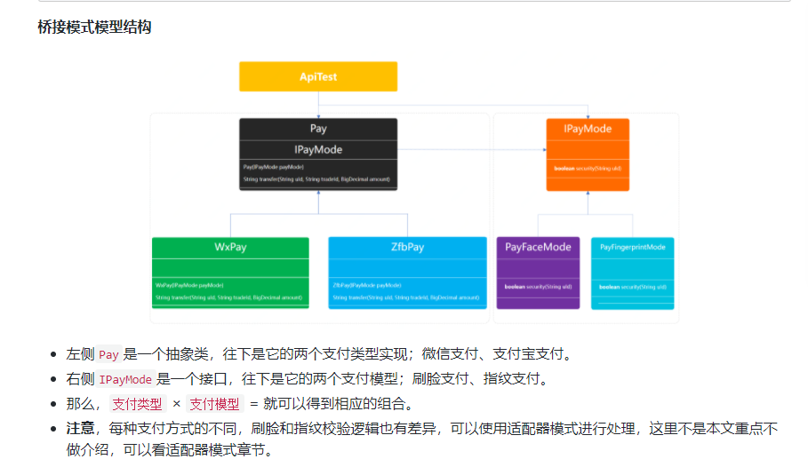

# 桥接模式重构代码

* 左侧Pay是一个抽象类，往下是它的两个支付类型实现；微信支付、支付宝支付。
* 右侧IPayMode是一个接口，往下是它的两个支付模型；刷脸支付、指纹支付。
* 那么，支付类型 × 支付模型 = 就可以得到相应的组合。
* 注意，每种支付方式的不同，刷脸和指纹校验逻辑也有差异，可以使用适配器模式进行处理，这里不是本文重点不做介绍，可以看适配器模式章节。

# 总结
* 通过模拟微信与支付宝两个支付渠道在不同的支付模式下，刷脸、指纹、密码，的组合从而体现了桥接模式的在这类场景中的合理运用。
  简化了代码的开发，给后续的需求迭代增加了很好的扩展性。
  
* 从桥接模式的实现形式来看满足了单一职责和开闭原则，让每一部分内容都很清晰易于维护和拓展，但如果我们是实现的高内聚的代码，
  那么就会很复杂。所以在选择重构代码的时候，需要考虑好整体的设计，否则选不到合理的设计模式，将会让代码变得难以开发。
  
* 任何一种设计模式的选择和使用都应该遵顼符合场景为主，不要刻意使用。而且统一场景因为业务的复杂从而可能需要使用到多种设计模式的组合，
  才能将代码设计的更加合理。但这种经验需要从实际的项目中学习经验，并提不断的运用。